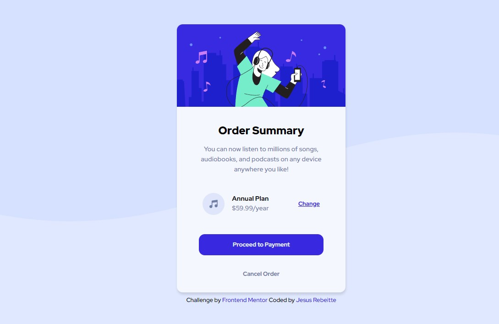

# Frontend Mentor - Order summary card solution

This is a solution to the [Order summary card challenge on Frontend Mentor](https://www.frontendmentor.io/challenges/order-summary-component-QlPmajDUj). Frontend Mentor challenges help you improve your coding skills by building realistic projects. 

## Table of contents

- [Frontend Mentor - Order summary card solution](#frontend-mentor---order-summary-card-solution)
  - [Table of contents](#table-of-contents)
  - [Overview](#overview)
    - [The challenge](#the-challenge)
    - [Screenshot](#screenshot)
    - [Links](#links)
  - [My process](#my-process)
    - [Built with](#built-with)
    - [What I learned](#what-i-learned)
  - [Author](#author)

## Overview

### The challenge

Users should be able to:

- See hover states for interactive elements

### Screenshot

### Links

- Solution URL: [Github solution](https://github.com/Rebeitte/order-summary-component)
- Live Site URL: [Live site](https://order-summary-jr.netlify.app/)

## My process

### Built with

- Semantic HTML5 markup
- CSS custom properties
- Flexbox
- Mobile-first workflow

### What I learned

I used this project to improve my CSS skills with the feedback that I received in my previous project [3 columns challenge](https://www.frontendmentor.io/solutions/3-columns-challenger-solution-Mf4r7cFS4). Also I added a :focus-visible in some interactive elements (links, buttons) for people who use tab to navigate through the site. My main idea for this project was use all my knowledge about HTML and CSS and the feedback that I received to improve my code and make it more readable and organized.

## Author

- Frontend Mentor - [@rebeitte](https://www.frontendmentor.io/profile/Rebeitte)
- Twitter - [@jesusrebeitte](https://twitter.com/jesusrebeitte)
